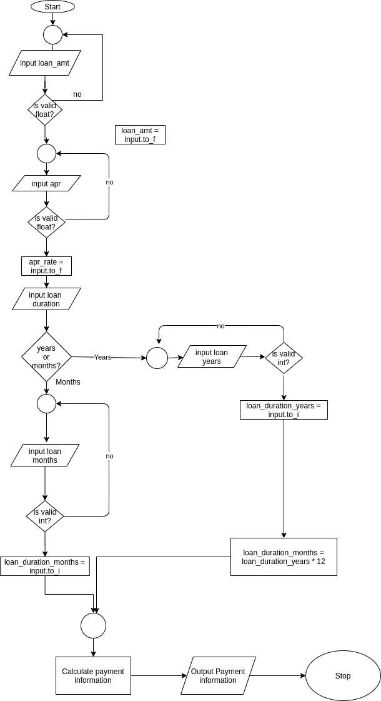

# PEDAC

## Problem

Build a mortgage/loan calculator:

* inputs:
  * loan amount
  * Annual Percentage Rate
  * loan duration
* outputs:
  * monthly interest rate # not outputted to user
  * loan duration in months # outputted as number of payments
  * monthly payment
  * total payment over life of loan
  * total interest paid over life of loan


Formula for calculation :

```ruby
m = p * (j / (1 - (1 + j)**(-n)))
```

* m = monthly payment
* p = loan amount
* j = monthly interest rate
* n = loan duration in months

### Input formats:

inputs are gotten as strings and will need to be converted to the appropriate format as follows: 

loan amount - float with 2 digits only after decimal point (fractions of pennies make no sense) = $10000.00

APR - float percentage - 6.0% or .01% etc. - 6% / 100 will give decimal value for formula

Loan Duration - integer number of years

### Output formats:

monthly interest rate: float converted to a float percentage - .005 = .5%, .002270833333333 = .2271% => this value is calculated by taking the APR / 12 = will give percentage.  APR/100 / 12 will give the decimal value. 

loan duration = integer: convert years to months: = years * 12 = months

monthly payment = float with 2 digits after decimal point (fractions of pennies make no sense) = $497.19 or $1220.75 for example

total payments = the sum of each monthly payment - monthly payment * number of months

total interest payment = total payments - initial loan amount.

Consider:

* what format do inputs need to be in.  for example, should interest rate be expressed as `5` or `.05` if you mean 5% interest
* If you are working with Annual Percentage Rate (APR), you'll need to convert that to a monthly interest rate.
* Be careful about the loan duration -- are you working with months or years?  Choose variable names carefully to assist in remembering. 

Monthly Interest Rate = Yearly Interest Rate (APR)/ 12

Interest Rate should be expressed as a decimal and not a percentage - convert user input to a decimal (divide by 100)

Duration entered by the user in years (can add a choice for years or months)

Calculate payments based on *months*.

### Mental Model for this problem:

Accept user input for valid loan amount, APR, and loan duration in years.  Compute the values needed to calculate loan information: monthly interest rate from APR, and number of months in the loan duration from the loan duration in years. Compute the monthly loan payment based on the computed values for the calculation formula.  Return to the user the monthly payment, the number of monthly payments, the total of the payments, and the total interest paid over the life of the loan.

### Clarifying Questions:

1. How will the factors be provided to the program? - through a gets() which will return a string value. These will need to be converted to various number formats of integer - to_i() and float - to_f()
2. What happens if a non-number, negative number, or a 0 is provided to the program? Will need to check input validity - none of these inputs are valid based on the problem.
3. What happens if the loan duration isn't a whole year?  May need to ask the user if they prefer to enter the loan duration in years or months.

## Examples:

 $30000 car loan at 6 years and 6% APR = monthly payment: $497.19, 72 monthly payments, total interest paid: $5797.44, monthly interest rate = .06/12 = .005, total payments over the life of the loan = $35797.44. Total interest paid = $5,797.44


$300000 home loan at 30 years and 2.725% APR = 360 monthly payments @ $1220.75 per month with monthly interest rate = .02725/12 = .002270833333333. Total of payments over the life of the loan = $441,043.50.  Total interest paid = $141,043.50

# Data Structure

input strings that are converted to integers or floats as appropriate based on the variable.  

variables:

loan_amt = float (2 digits) => user input

apr_rate = float => user input - this is a percentage and not the converted decimal value

loan_duration_years = integer => user input

__________________________

loan_duration_months = integer => either user input or converted by loan_duration_years * 12

monthly_interest_rate = (apr_rate/100)/12

monthly_payment = float (2 digits) => calculated by formula

total_payment = float (2 digits) => calculated by monthly_payment * loan_duration_months

total_interest_payment = float (2 digits) => calculated by total_payment - loan_amt

# Algorithm





```psuedocode
START

LOOP
  GET loan_amt
    IF loan_amt is valid
      SET loan_amt
      BREAK
      
 LOOP
  GET apr_rate
    IF apr_rate is valid
      SET apr_rate
      BREAK  
      
GET user months or years?
  IF years?
    LOOP
      GET loan_duration_years
        IF loan_duration_years is valid
          SET loan_duration_years
          SET loan_duration_months = loan_duration_years * 12
          BREAK
   IF months?
     LOOP
       GET loan_duration_months
         IF loan_duration_months is valid
           SET loan_duration_months
           BREAK
   
SET monthly_interest_rate = (apr_rate / 100) / 12
SET monthly_payment = loan_amt * (monthly_interest_rate / (1 - (1 + monthly_interst_rate)**(-loan_duration_months)))
SET total_payment = monthly_payment * loan_duration_months
SET interest_payment = total_payment - loan_amt

PRINT monthly_payment
PRINT loan_duration_months
PRINT total_payment
PRINT interest_payment

END

```


